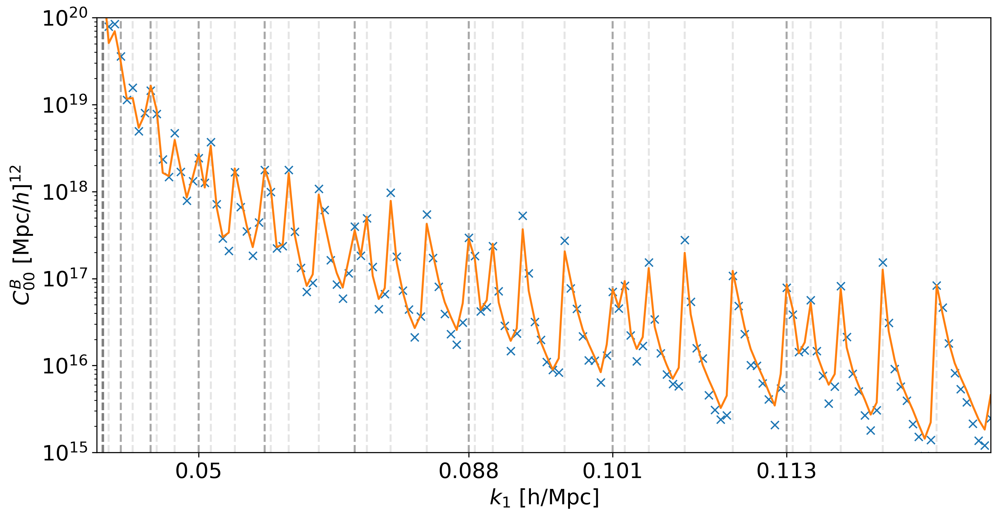

Bispectrum Module
=================

The bispectrum module (``bk``) provides functions to compute various contributions to the galaxy bispectrum in redshift space. The bispectrum output is available in two formats: as multipole moments and as the full angle-dependent local bispectrum.

Bispectrum Multipoles
---------------------

The bispectrum can be expanded in terms of the "Scoccimarro" spherical harmonic multipoles, which are defined with respect to the orientation of the triangle to the line-of-sight.

Here's an example class from the bispectrum module:

.. class:: bk.NPP

    This class computes the Newtonian plane-parallel constant redshift terms.

    Methods
    -------

    .. method:: lx(cosmo_functions, k1, k2, k3=None, theta=None, zz=0, r=0, s=0, sigma=None)

        Compute the x-th multipole \( l_x \) of the bispectrum for the Newtonian contribution.

        :param object cosmo_functions: An instance of `ClassWAP` containing cosmology and survey biases.
        :param array-like k1: Wavevector magnitude 1, broadcastable array in units of [Mpc/h].
        :param array-like k2: Wavevector magnitude 2, broadcastable array in units of [Mpc/h].
        :param array-like k3: (Optional) Wavevector magnitude 3, broadcastable array in units of [Mpc/h]. Either `k3` or `theta` must be set.
        :param array-like theta: (Optional) Outside angle θ, broadcastable array. Either `theta` or `k3` must be set.
        :param array-like zz: Redshift, broadcastable array with k vectors. Default is 0.
        :param float r: Parameter `r` that sets the Line of Sight (LoS) in the local triplet. Default is 0.
        :param float s: Parameter `s` that sets the Line of Sight (LoS) in the local triplet. Default is 0.
        :param float sigma: (Optional) Linear dispersion that sets FoG damping. Default is None.
        :return: Bispectrum multipole contribution in units of [h/Mpc]^6.
        
    .. method:: ylm(l, m, cosmo_functions, k1, k2, k3=None, theta=None, zz=0, r=0, s=0, sigma=None)

        Compute the multipole \(\ell,m\) of the bispectrum by performing the angular integral numerically.

        :param int l: The degree of the spherical harmonic.
        :param int m: The order of the spherical harmonic.
        :param object cosmo_functions: An instance of `ClassWAP` containing cosmology and survey biases.
        :param array-like k1: Wavevector magnitude 1, broadcastable array in units of [Mpc/h].
        :param array-like k2: Wavevector magnitude 2, broadcastable array in units of [Mpc/h].
        :param array-like k3: (Optional) Wavevector magnitude 3, broadcastable array in units of [Mpc/h]. Either `k3` or `theta` must be set.
        :param array-like theta: (Optional) Outside angle θ, broadcastable array. Either `theta` or `k3` must be set.
        :param array-like zz: Redshift, broadcastable array with k vectors. Default is 0.
        :param float r: Parameter `r` that sets the Line of Sight (LoS) in the local triplet. Default is 0.
        :param float s: Parameter `s` that sets the Line of Sight (LoS) in the local triplet. Default is 0.
        :param float sigma: (Optional) Linear dispersion that sets FoG damping. Default is None.
        :return: Bispectrum multipole contribution in units of [h/Mpc]^6.

Available Bispectrum Classes
----------------------------

CosmoWAP provides multiple classes for different contributions to the bispectrum:

* `NPP`: Newtonian plane-parallel (Kaiser)
* `WA1`: First-order wide-angle corrections
* `WA2`: Second-order wide-angle corrections
* `RR1`: First-order radial-redshift corrections
* `RR2`: Second-order radial-redshift corrections
* `WS`: Combined wide-separation terms (wide-angle + radial-redshift)
* `GR1`: First-order relativistic corrections
* `GR2`: Second-order relativistic corrections
* `Loc`: Local-type primordial non-Gaussianity
* `Eq`: Equilateral-type primordial non-Gaussianity
* `Orth`: Orthogonal-type primordial non-Gaussianity

Each class follows the same interface with `lx()` methods for computing multipoles of order x, and a `ylm()` method for numerical integration of arbitrary multipoles.

Full Local Bispectrum
---------------------

In addition to the multipole decomposition, CosmoWAP also provides functions to compute the full angle-dependent local bispectrum.

.. function:: bk.Bk_0(mu, phi, cosmo_functions, k1, k2, k3=None, theta=None, zz=0, r=0, s=0, sigma=None)

    Compute the angle-dependent Newtonian bispectrum.

    :param float mu: Cosine of the angle between the LOS and \(k_1\)
    :param float phi: Azimuthal angle between LOS and \(k_2\) in plane normal to \(k_1\).
    :param object cosmo_functions: An instance of `ClassWAP` containing cosmology and survey biases.
    :param array-like k1: Wavevector magnitude 1, broadcastable array in units of [Mpc/h].
    :param array-like k2: Wavevector magnitude 2, broadcastable array in units of [Mpc/h].
    :param array-like k3: (Optional) Wavevector magnitude 3, broadcastable array in units of [Mpc/h]. Either `k3` or `theta` must be set.
    :param array-like theta: (Optional) Outside angle θ, broadcastable array. Either `theta` or `k3` must be set.
    :param array-like zz: Redshift, broadcastable array with k vectors. Default is 0.
    :param float r: Parameter `r` that sets the Line of Sight (LoS) in the local triplet. Default is 0.
    :param float s: Parameter `s` that sets the Line of Sight (LoS) in the local triplet. Default is 0.
    :param float sigma: (Optional) Linear dispersion that sets FoG damping. Default is None.
    :return: The bispectrum contribution, in units of [h/Mpc]^6.

Similarly, there are functions for all other contributions following the naming pattern `Bk_X` where X is the corresponding contribution type (WA_1, GR_1, etc.).

Bispectrum Gaussian Covariance
------------------------------

CosmoWAP also provides functionality to compute the Gaussian covariance of the bispectrum multipoles.

.. class:: bk.COV(cosmo_functions, k1, k2, k3, theta, zz, r=0, s=0)

    Compute the Gaussian covariance for bispectrum multipoles.

    :param object cosmo_functions: An instance of `ClassWAP`.
    :param array-like k1: First wavevector magnitude.
    :param array-like k2: Second wavevector magnitude.
    :param array-like k3: Third wavevector magnitude.
    :param array-like theta: Outside angle of the triangle.
    :param float zz: Redshift.
    :param float r: Parameter `r` for LOS specification.
    :param float s: Parameter `s` for LOS specification.

    Methods
    -------

    .. method:: Nab_cd()

        Compute the covariance between ℓ1=a, m1=b and ℓ2=c, m2=d multipoles.

        The notation is `Nab_cd` where a, b, c, d are the multipole and m-indices.
        For example, `N00_00` is the covariance of the monopole (ℓ=0, m=0) with itself.
        
        :return: Covariance value.
        
Comparison with Sims
--------------------

Gaussian covariance compared to the measured covariance from 100 fiducial Quijote `Quijote <https://quijote-simulations.readthedocs.io/en/latest/index.html>`_ sims.

