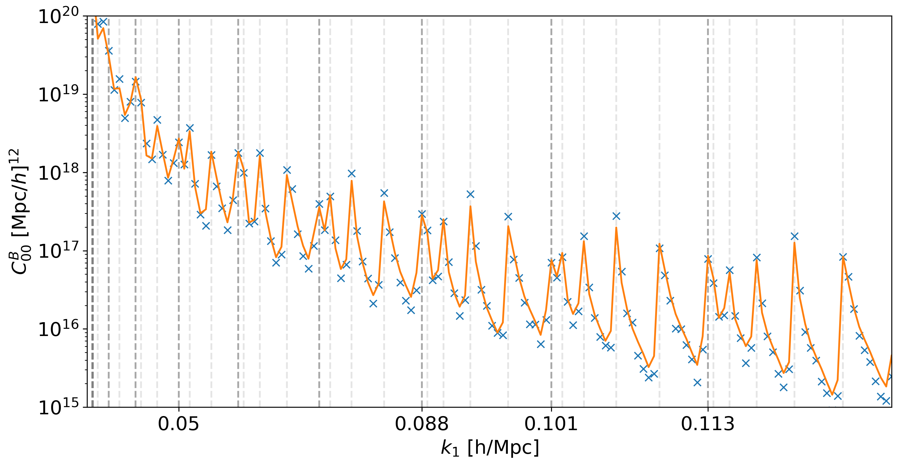

Gaussian Covariance
===================

CosmoWAP computes the Gaussian covariance of power spectrum and bispectrum multipoles, needed for Fisher forecasting, SNR calculations, and likelihood analyses.

The covariance pipeline uses the **numerical** :math:`\mu` **integration** framework: the full :math:`P(k,\mu)` is constructed from the ``pk_int`` kernel machinery (via ``pk.get_mu``) for each term, then projected onto multipole covariances via Gauss-Legendre quadrature. This means that any combination of terms (Newtonian, wide-separation, relativistic, integrated effects) is handled through the same interface -- including contributions that would be difficult to express analytically, such as integrated x GR cross-terms.

Power Spectrum Covariance
-------------------------

The Gaussian covariance of the power spectrum multipoles is:

.. math::

   C[P^{ab}_{\ell_1}, P^{cd}_{\ell_2}](k) = \frac{(2\ell_1+1)(2\ell_2+1)}{N_k} \int \frac{d\Omega_k}{4\pi}\, \mathcal{L}_{\ell_1}(\mu) \left[ \mathcal{L}_{\ell_2}(\mu)\, \tilde{P}^{ac}(k,\mu)\, \tilde{P}^{bd*}(k,\mu) + \mathcal{L}_{\ell_2}(-\mu)\, \tilde{P}^{ad}(k,\mu)\, \tilde{P}^{bc*}(k,\mu) \right]

where :math:`\tilde{P}(k,\mu) = P(k,\mu) + 1/\bar{n}` includes shot noise and the indices :math:`a,b,c,d` label tracer populations.

Each :math:`P(k,\mu)` is built by ``pk.get_mu``, which uses the ``pk_int`` kernel machinery to evaluate the full angle-dependent power spectrum for a given term (e.g. ``'NPP'``, ``'GR2'``, ``'IntNPP'``). The :math:`\mu` integral is then performed via Gauss-Legendre quadrature with ``n_mu`` nodes.

Bispectrum Covariance
---------------------

The Gaussian covariance of the bispectrum spherical harmonic multipoles is:

.. math::

   C[B_{\ell_1 m_1}, B_{\ell_2 m_2}](k_1, k_2, k_3) = \frac{1}{N_{\rm tri}} \int \frac{d\Omega_k}{4\pi}\, 4\pi\, Y^*_{\ell_1 m_1}(\hat{k})\, Y_{\ell_2 m_2}(\hat{k}) \, \tilde{P}(k_1,\mu_1)\, \tilde{P}(k_2,\mu_2)\, \tilde{P}(k_3,\mu_3)

where :math:`\mu_i = \hat{k} \cdot \hat{k}_i` and the integration is over the orientation of the triangle relative to the line of sight.

The same ``pk.get_mu`` is used to build each of the three :math:`P(k_i, \mu_i)`, and the integration is now **2D** over :math:`(\mu, \phi)` using Gauss-Legendre quadrature with ``n_mu`` and ``n_phi`` nodes respectively. The spherical harmonics :math:`Y_{\ell m}` replace the Legendre polynomials used in the power spectrum case. FoG damping is applied independently to each triangle leg via :math:`e^{-(k_i \mu_i)^2 \sigma^2 / 2}`.

Multi-Tracer Covariance
-----------------------

For Fisher forecasting, the full multi-tracer multipole covariance is needed. This is handled by ``FullCovPk`` and ``FullCovBk`` in the ``forecast`` module, which are called internally by ``FullForecast.get_fish()``.

FullCovPk
~~~~~~~~~

.. class:: forecast.covariances.FullCovPk(fc, cosmo_funcs_list, cov_terms, sigma=None, n_mu=64, fast=False, nonlin=False, old=False)

   Multi-tracer power spectrum multipole covariance for a single redshift bin.

   :param fc: ``PkForecast`` instance
   :param list cosmo_funcs_list: List of ``ClassWAP`` instances for each tracer combination
   :param list cov_terms: Terms to include (e.g. ``['NPP', 'GR2', 'IntNPP']``)
   :param float sigma: FoG damping
   :param int n_mu: Number of Gauss-Legendre nodes for :math:`\mu` integration (default: 64)
   :param bool fast: Use symmetry to integrate over :math:`[0,1]` only
   :param bool nonlin: Use HALOFIT power spectra in covariance
   :param bool old: Use legacy analytical :math:`P_\ell(\mu)` instead of ``pk.get_mu``

   .. method:: get_cov(ln, sigma=None)

      Compute the full covariance matrix for the given list of multipoles.

      :param list ln: Multipole orders (e.g. ``[0, 2, 4]``)
      :return: Array of shape ``(N_data, N_data, N_k)``

   For **single-tracer**, the data vector is :math:`\{P_{\ell_1}(k), P_{\ell_2}(k), \ldots\}` and the covariance has shape ``(len(ln), len(ln), N_k)``.

   For **multi-tracer** (bright/faint split), even multipoles have three tracer spectra (:math:`P^{BB}_\ell, P^{BF}_\ell, P^{FF}_\ell`) while odd multipoles have only the cross-spectrum (:math:`P^{BF}_\ell`). The covariance matrix accounts for all cross-correlations between tracer combinations and multipoles.

FullCovBk
~~~~~~~~~

.. class:: forecast.covariances.FullCovBk(fc, cosmo_funcs_list, cov_terms, sigma=None, n_mu=64, n_phi=32, fast=False, nonlin=False, old=False)

   Multi-tracer bispectrum multipole covariance for a single redshift bin.

   :param fc: ``BkForecast`` instance
   :param list cosmo_funcs_list: List of ``ClassWAP`` instances for each tracer combination
   :param list cov_terms: Terms to include
   :param float sigma: FoG damping
   :param int n_mu: Gauss-Legendre nodes for :math:`\mu` (default: 64)
   :param int n_phi: Gauss-Legendre nodes for :math:`\phi` (default: 32)
   :param bool fast: Use symmetry to halve the :math:`\mu` range
   :param bool nonlin: Use HALOFIT power spectra
   :param bool old: Use legacy analytical expressions

   .. method:: get_cov(ln)

      Compute the full covariance matrix.

      :param list ln: Multipole orders (e.g. ``[0]``)
      :return: Array of shape ``(N_data, N_data, N_tri)``

   For **multi-tracer** bispectrum, the tracer combinations are :math:`B^{BBB}, B^{BBF}, B^{BFF}, B^{FFF}`, giving a ``(4*len(ln), 4*len(ln), N_tri)`` covariance matrix.

Caching
~~~~~~~

Both ``FullCovPk`` and ``FullCovBk`` precompute and cache :math:`P(k,\mu)` for all terms and tracer combinations during initialisation (``create_cache``). The :math:`\mu` integration for different multipole pairs then reuses these cached values, avoiding redundant evaluations of the power spectrum -- this is the most expensive step, particularly when integrated effects are included.

Nonlinear Corrections
---------------------

Nonlinear corrections to the covariance can be included in two ways:

- **``nonlin=True`` in ``FullCovPk``/``FullCovBk``**: Replaces the linear :math:`P(k)` with the HALOFIT nonlinear power spectrum throughout the covariance.
- **``nonlin=True`` in ``bk.COV.cov()``**: Adds a one-loop correction following `Eq. 27 of 1610.06585 <https://arxiv.org/abs/1610.06585>`_, replacing the linear :math:`P(k_i)` with :math:`\Delta P(k_i) = P^{\rm NL}(k_i) - P^{\rm lin}(k_i)` for each triangle leg in turn.

Comparison with Simulations
---------------------------

Gaussian covariance compared to the measured covariance from 100 fiducial `Quijote <https://quijote-simulations.readthedocs.io/en/latest/index.html>`_ simulations.

Analytical Expressions
----------------------

Analytically-derived multipole covariance expressions (exported from Mathematica) are also available for the Newtonian tree-level case, optionally including FoG damping. These are useful for quick checks or when only the Newtonian contribution is needed.

- **Power spectrum**: ``pk.COV`` provides methods ``N00()``, ``N20()``, ``N22()``, ``N40()``, ``N42()``, ``N44()`` (even) and ``N11()``, ``N31()``, ``N33()`` (odd) for :math:`C[P_{\ell_1}, P_{\ell_2}](k)`.
- **Power spectrum numerical**: ``pk.COV_MU`` provides ``cov_l1l2(term1, term2, l1, l2, ...)`` for numerically integrating arbitrary term pairs.
- **Bispectrum**: ``bk.COV`` provides analytical multipole methods (e.g. ``N00()``, ``N20()``, ``N00_00()``) with naming convention ``Nab_cd`` for :math:`C[B_{\ell_1=a,m_1=b}, B_{\ell_2=c,m_2=d}]`. When ``sigma`` is set, ``bk.COV`` automatically switches to numerical :math:`\mu`-:math:`\phi` integration via its ``ylm()`` method.
