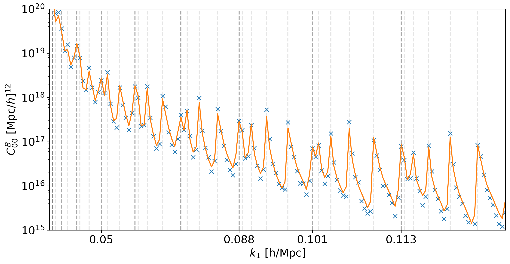

Covariance
==========

CosmoWAP computes the Gaussian covariance of (multi-tracer) power spectrum and bispectrum multipoles, which are used in the forecasting modules. The leading non-Gaussian bispectrum terms and the power spectrum-bispectrum cross-covariance can be added on top - see :ref:`cov-ng`.

The covariance pipeline uses the **numerical** :math:`\mu` **integration** framework: the full :math:`P(k,\mu)` is constructed from the ``numeric_mu`` kernel machinery (via ``numeric_mu.pk.get_mu_sym``) for each term, then projected onto multipole covariances via Gauss-Legendre quadrature. This means that any combination of terms (Newtonian, wide-separation, relativistic, integrated effects) is handled through the same interface - this is particularly important for including integrated contributions where there is a big speedup.

Power Spectrum Covariance
-------------------------

For full details see Appendix B of `arXiv:2511.09466 <https://arxiv.org/abs/2511.09466>`_. Briefly:

The Gaussian covariance of the power spectrum multipoles is:

.. math::

   C[P^{ab}_{\ell_1}, P^{cd}_{\ell_2}](k) = \frac{(2\ell_1+1)(2\ell_2+1)}{N_k} \int \frac{d\Omega_k}{4\pi}\, \mathcal{L}_{\ell_1}(\mu) \left[ \mathcal{L}_{\ell_2}(\mu)\, \tilde{P}^{ac}(k,\mu)\, \tilde{P}^{bd*}(k,\mu) + \mathcal{L}_{\ell_2}(-\mu)\, \tilde{P}^{ad}(k,\mu)\, \tilde{P}^{bc*}(k,\mu) \right]

where :math:`\tilde{P}^{ab}(\mathbf{k},\mathbf{d}) = P^{ab}_{\rm loc}(\mathbf{k},\mathbf{d}) + \frac{\delta^K_{a,b}}{n_a}` includes shot noise and the indices :math:`a,b,c,d` label tracer populations.

Each :math:`P(k,\mu)` is built by ``numeric_mu.pk.get_mu_sym``, which uses the ``numeric_mu`` kernel machinery to evaluate the full angle-dependent power spectrum for a given term (e.g. ``'NPP'``, ``'GR2'``, ``'IntNPP'``). The :math:`\mu` integral is then performed via Gauss-Legendre quadrature with ``n_mu`` nodes.

Bispectrum Covariance
---------------------

For full details see Section 4.1.1 of Addis (2026), *Constraints and biases: joint power spectrum and bispectrum forecasts on ultra-large scales*.

The Gaussian covariance of the bispectrum spherical harmonic multipoles is, for a single tracer (see Addis (2026) for the multi-tracer expression):

.. math::

   C[B_{\ell_1 m_1}, B_{\ell_2 m_2}](k_1, k_2, k_3) = \frac{1}{N_{\rm tri}} \int \frac{d\Omega_k}{4\pi}\, 4\pi\, Y^*_{\ell_1 m_1}(\hat{k})\, Y_{\ell_2 m_2}(\hat{k}) \, \tilde{P}(k_1,\mu_1)\, \tilde{P}(k_2,\mu_2)\, \tilde{P}(k_3,\mu_3)

where :math:`\mu_i = \hat{k} \cdot \hat{k}_i` and the integration is over the orientation of the triangle relative to the line of sight.

The same ``pk.get_mu_sym`` is used to build each of the three :math:`P(k_i, \mu_i)`, and the integration is now **2D** over :math:`(\mu, \phi)` using Gauss-Legendre quadrature with ``n_mu`` and ``n_phi`` nodes respectively. The spherical harmonics :math:`Y_{\ell m}` replace the Legendre polynomials used in the power spectrum case. FoG damping is applied to each leg's power spectrum via :math:`e^{-(k_i \mu_i)^2 \sigma^2}` - ``sigma`` is per galaxy field, and a power spectrum has two (see :ref:`forecast-fog`).

With ``FullForecast(all_m=True)`` the :math:`m > 0` rows use :math:`{\rm Re}\,Y_{\ell m}` on both sides, each evaluated in the frame of its own triangle (:math:`z` along its :math:`k_1`, :math:`k_2` in the :math:`xz`-plane) - so on equal sides the relabelled Wick terms carry :math:`(-1)^m` from the :math:`k_2 \leftrightarrow k_3` swap.

Multi-Tracer Covariance
-----------------------

For Fisher forecasting, the full multi-tracer multipole covariance is needed. This is handled by ``FullCovPk`` and ``FullCovBk`` in the ``forecast`` module, which are called internally by ``FullForecast.get_fish()``.

FullCovPk
~~~~~~~~~

.. class:: forecast.covariances.FullCovPk(fc, cf_mat, cov_terms, sigma=None, n_mu=64, fast=False, nonlin=False, kernels=True)

   Multi-tracer power spectrum multipole covariance for a single redshift bin.

   :param fc: ``PkForecast`` instance
   :param list cf_mat: List of ``ClassWAP`` instances for each tracer combination
   :param list cov_terms: Terms to include (e.g. ``['NPP', 'GR2', 'IntNPP']``)
   :param float sigma: FoG damping
   :param int n_mu: Number of Gauss-Legendre nodes for :math:`\mu` integration (default: 64)
   :param bool fast: Use symmetry to integrate over :math:`[0,1]` only. Only valid when every :math:`\ell` pair in ``ln`` has the same parity - a mixed pair cancels over :math:`[-1,1]` and this keeps the half-integral instead. Samples the same number of nodes either way, so it is no cheaper unless ``n_mu`` drops with it (default: False)
   :param bool nonlin: Use HALOFIT power spectra in covariance
   :param bool kernels: Work directly with ``numeric_mu`` kernels (default). If ``False``, use :math:`P(k, \mu)` expressions directly.

   .. method:: get_cov(ln, sigma=None)

      Compute the full covariance matrix for the given list of multipoles.

      :param list ln: Multipole orders (e.g. ``[0, 2, 4]``)
      :return: Array of shape ``(N_data, N_data, N_k)``

   For **single-tracer**, the data vector is :math:`\{P_{\ell_1}(k), P_{\ell_2}(k), \ldots\}` and the covariance has shape ``(len(ln), len(ln), N_k)``.

   For **multi-tracer** (bright/faint split), even multipoles have three tracer spectra (:math:`P^{BB}_\ell, P^{BF}_\ell, P^{FF}_\ell`) while odd multipoles have only the cross-spectrum (:math:`P^{BF}_\ell`). The covariance matrix accounts for all cross-correlations between tracer combinations and multipoles.

FullCovBk
~~~~~~~~~

.. class:: forecast.covariances.FullCovBk(fc, cf_mat, cov_terms, sigma=None, n_mu=64, n_phi=32, fast=False, nonlin=False, kernels=True)

   Multi-tracer bispectrum multipole covariance for a single redshift bin.

   :param fc: ``BkForecast`` instance
   :param list cf_mat: List of ``ClassWAP`` instances for each tracer combination
   :param list cov_terms: Terms to include
   :param float sigma: FoG damping
   :param int n_mu: Gauss-Legendre nodes for :math:`\mu` (default: 64)
   :param int n_phi: Gauss-Legendre nodes for :math:`\phi` (default: 32)
   :param bool fast: Use symmetry to halve the :math:`\mu` range. Same parity restriction as ``FullCovPk`` above (default: False)
   :param bool nonlin: Use HALOFIT power spectra
   :param bool kernels: Work directly with kernels (default). If ``False``, use Bk expressions directly.

   .. method:: get_cov(ln)

      Compute the full covariance matrix.

      :param list ln: Multipole orders (e.g. ``[0]``)
      :return: Array of shape ``(N_data, N_data, N_tri)``

   For **multi-tracer** bispectrum, the tracer combinations are :math:`B^{BBB}, B^{BBF}, B^{BFF}, B^{FFF}`, giving a ``(4*len(ln), 4*len(ln), N_tri)`` covariance matrix.

Caching
~~~~~~~

Both ``FullCovPk`` and ``FullCovBk`` precompute and cache :math:`P(k,\mu)` for all terms and tracer combinations during initialisation (``create_cache``). The :math:`\mu` integration for different multipole pairs then reuses these cached values, avoiding redundant evaluations of the power spectrum - this is the most expensive step, particularly when integrated effects are included.

Nonlinear Corrections
---------------------

Nonlinear corrections to the covariance can be included in two ways:

- **``nonlin=True`` in ``FullCovPk``/``FullCovBk``**: Replaces the linear :math:`P(k)` with the HALOFIT nonlinear power spectrum throughout the covariance.
- **``nonlin=True`` in ``bk.COV.cov()``**: Adds nonlinear correction following `Eq. 27 of 1610.06585 <https://arxiv.org/abs/1610.06585>`_, replacing the linear :math:`P(k_i)` with :math:`\Delta P(k_i) = P^{\rm NL}(k_i) - P^{\rm lin}(k_i)` for each triangle leg in turn.

.. _cov-ng:

Non-Gaussian Covariance
-----------------------

For full details see the non-Gaussian contributions section of Addis (2026), *Constraints and biases: joint power spectrum and bispectrum forecasts on ultra-large scales*.

The Gaussian bispectrum covariance typically overestimates the information content, particularly for squeezed configurations. Beyond the Gaussian (:math:`PPP`) term, the leading contributions to the bispectrum covariance are the :math:`BB` and :math:`PT` terms of the 6-point function, and in a joint analysis the power spectrum and bispectrum are correlated through the :math:`PB` term of the 5-point function. Unlike :math:`PPP`, which pairs every side of one triangle with a side of the other, these link the two estimators through a single **shared mode**, so they couple different triangle bins (and :math:`k`-bins) whenever they share a :math:`k`-shell. They are all evaluated in the plane-parallel constant-redshift limit.

Switch them on with ``cov_ng``:

.. code-block:: python

    forecast = FullForecast(cosmo_funcs, kmax_func=0.1, N_bins=4, cov_ng=True)

    # bk only: Gaussian + BB + PT
    fish_bk = forecast.get_fish(["fNL"], terms=["NPP", "Loc"], bkln=[0, 1, 2, 3])

    # pk and bk together: also the pk-bk cross-covariance, so the joint (d_pk, d_bk) is inverted together
    fish = forecast.get_fish(["fNL"], terms=["NPP", "Loc"], pkln=[0, 2], bkln=[0, 1, 2, 3])

``cov_ng`` is used by ``get_fish``, the SNR methods and the ``Sampler`` likelihood. ``ng_kwargs`` is passed on to ``BBCovBk`` (``n_mu``, ``n_psi``, ``n_delta``) - the defaults are converged. The power spectrum covariance itself stays Gaussian, and the connected 6- and 5-point (tetraspectrum) terms are neglected.

**BB + PT.** Each :math:`BB` pairing groups two fields of one triangle with one of the other, so the element is a product of two bispectra with the shared side at :math:`-\mathbf{k}` in one of them. Since :math:`B(-\mathbf{k}_1,-\mathbf{k}_2,-\mathbf{k}_3) = B^*(\mathbf{k}_1,\mathbf{k}_2,\mathbf{k}_3)` and :math:`\mathcal{L}_\ell(-\mu) = (-1)^\ell\mathcal{L}_\ell(\mu)`, :math:`BB` alone is indefinite: odd multipoles get a negative variance and their SNR increases spuriously. So it is always used together with :math:`PT`, which we take in its collapsed (squeezed) limit, :math:`P\,T \to \hat B \hat B'^*\,[1 + \delta^K/(nP)]` with the shared side at :math:`+\mathbf{k}` - separable, and used for all nine pairings. Together, per shared side,

.. math::

   C^{BB}+C^{PT} \simeq (2\ell_i+1)(2\ell_j+1)\frac{\delta^K_{k_1 q_1}}{N_{k_1}}\int\frac{\mathrm{d}\Omega}{4\pi}\int_0^{2\pi}\frac{\mathrm{d}\phi'}{2\pi}\,
   \mathcal{L}_{\ell_i}(\mu_1)\mathcal{L}_{\ell_j}(\mu_1)\,\hat B(\mathbf{k}_1,\mathbf{k}_2,\mathbf{k}_3)
   \Big[\Big(1+\frac{\delta^K}{nP(\mathbf{k}_1)}\Big)\hat B'(\mathbf{k}_1,\ldots) + (-1)^{\ell_j}\hat B'(-\mathbf{k}_1,\ldots)\Big]^* + 8\ \text{perms},

where :math:`N_k = 4\pi k^2\Delta k/k_f^3` is the number of modes in the shell. For the real-space monopole this recovers the usual :math:`C^{PT} \simeq C^{BB} = \hat B\hat B'/N_k` (Biagetti et al. 2022; Salvalaggio et al. 2024), while for odd multipoles of a real (Newtonian) bispectrum the clustering parts cancel - so the odd multipoles, which carry the leading local relativistic signal, are largely insensitive to these terms. For a single tracer :math:`BB + PT` is positive semi-definite by construction.

Some choices worth knowing:

- **Shot noise** follows the catalogue-subtracted estimators: galaxies coinciding within one triangle are subtracted, those across the two estimators kept. So :math:`\hat B^{abc} = B^{abc} + \delta^K_{ab}P^{ca}(k_3)/n_a + \delta^K_{ac}P^{ba}(k_2)/n_a`, with the shared side first, and no :math:`P(k_1)/n` or :math:`1/n^2` terms (Sugiyama et al. 2020).
- **Multi-tracer**: the tracers on the shared side are exchanged between the two triangles. For the clustering part we take this exchange in the squeezed limit, :math:`B^{dbc} \to (Z_1^d/Z_1^a)B^{abc}`, where the ratios cancel; the shot noise keeps the exact exchange. This breaks positive semi-definiteness slightly, so it is the total with the Gaussian part that must be (and is) positive definite.
- **Mode counting** uses the bin-averaged closure, as the Gaussian ``V123``, so it is only approximate (up to ~25%) for flattened triangle bins. ``n_delta > 1`` resolves the closure fraction across the shell, at ``n_delta``:sup:`2` the memory.

**PB.** The power spectrum-bispectrum cross-covariance contracts one field of :math:`\hat P` with a side of the triangle and closes a bispectrum with the other, so the other tracer of :math:`\hat P` takes the place of the shared side,

.. math::

   C[\hat P^{ab}_{\ell_i}, \hat B^{def}_{\ell_j}] = (2\ell_i+1)(2\ell_j+1)\frac{\delta^K_{k q_1}}{N_k}\int\frac{\mathrm{d}\Omega}{4\pi}\,
   \mathcal{L}_{\ell_i}(\mu_1)\mathcal{L}_{\ell_j}(\mu_1)\Big(\hat P^{ad}\hat B^{bef*} + (-1)^{\ell_i}\hat P^{bd}\hat B^{aef*}\Big) + 2\ \text{perms}.

The mode count here is exact. For consistency with :math:`BB + PT` the tracer exchange of the clustering part is again the squeezed one - with the exact exchange the multi-tracer joint covariance is not positive definite. For the real-space monopole this is :math:`2\hat P\hat B/N_k` per shared side.

With these choices the Gaussian :math:`C_{PP}`, :math:`BB + PT` and :math:`PB` follow from one model, in which each triangle responds to the power in its shared modes. In multi-tracer forecasts :math:`PB` can *improve* constraints (e.g. on :math:`f_{\rm NL}`) through sample-variance cancellation.

Implementation
~~~~~~~~~~~~~~

After the azimuthal integrals, the non-Gaussian terms depend on the configurations only through :math:`\mu` of the shared mode, so with ``n_mu`` Gauss-Legendre nodes they are a low-rank product, :math:`C^{\rm NG} = W\Xi W^\dagger`: one column of :math:`W` per :math:`k`-shell, :math:`\mu`-node and tracer, and :math:`\Xi` coupling columns only within a shell. The rank does not depend on the number of triangles, and the inverse follows from the Woodbury identity

.. math::

   \left(D+W\Xi W^\dagger\right)^{-1} = D^{-1} - D^{-1}W\Xi\left(I+W^\dagger D^{-1}W\Xi\right)^{-1}W^\dagger D^{-1},

with :math:`D` the Gaussian covariance (block diagonal in :math:`k`-bins and triangles), so the dense covariance is never formed.

.. class:: forecast.covariances.BBCovBk(fc, cov_terms, ln, sigma=None, n_mu=12, n_psi=8, pt=True, n_delta=1)

   :math:`BB` (+ :math:`PT` with ``pt=True``) bispectrum covariance for a ``BkForecast``, as the factors ``U``, ``lam``. ``n_psi`` sets the quadrature over each triangle's rotation about the shared side. ``pt=False`` (:math:`BB` alone, with the exact tracer exchange) is a diagnostic only.

.. class:: forecast.covariances.PBCov(pk_fc, bb, ln)

   Power spectrum-bispectrum cross-covariance, pairing ``pk_fc`` (a ``PkForecast`` with the same tracers and :math:`k`-bins) with the columns of ``bb``. Neglects the connected (tetraspectrum) term.

.. class:: forecast.covariances.WoodburyInvCov(blocks, lam, n_shell, chunk=1024)

   The Woodbury inverse for one data vector (bk) or several (pk and bk). ``contract(d1, d2)`` gives :math:`d_1^\dagger C^{-1} d_2`. Only holds arrays, so it pickles with the ``Sampler``.

.. class:: forecast.covariances.PTTreeCovBk(fc, cov_terms, ln, n_mu=12, n_psi=16, channels="stu3", shot=True, chunk=64)

   The :math:`PT` term with the full tree-level trispectrum (``numeric_mu.bk.get_T_tree`` - exchange channels ``s``, ``t``, ``u`` and ``3`` for :math:`T_{3111}`, Newtonian kernels). Dense, :math:`(N_{\rm tri} n_{\rm rows})^2`, so only for small :math:`k_{\rm max}` - a check on the collapsed limit used by ``BBCovBk``, not wired into ``FullForecast``.

Internally ``BkForecast.get_inv_cov`` returns a ``WoodburyInvCov`` when ``cov_ng`` is set, and ``core.joint_inv_cov`` builds the joint one; ``core.contract`` handles both the block-diagonal Gaussian inverse and these.

Comparison with Simulations
---------------------------

Gaussian covariance compared to the measured covariance from 100 fiducial `Quijote <https://quijote-simulations.readthedocs.io/en/latest/index.html>`_ simulations.

The bispectrum covariance is the Gaussian one, normalised by :math:`(2\pi)^3/V_{123}` with no rescaling to the simulations - it underestimates the Quijote covariance by 5-15%, the non-Gaussian terms above making up the difference.

Analytical Expressions
----------------------

Analytically-mu multipole covariance expressions (exported from Mathematica) are also available for the Newtonian tree-level case, optionally including FoG damping.

- **Power spectrum**: ``pk.COV`` provides methods ``N00()``, ``N20()``, ``N22()``, ``N40()``, ``N42()``, ``N44()`` (even) and ``N11()``, ``N31()``, ``N33()`` (odd) for :math:`C[P_{\ell_1}, P_{\ell_2}](k)`.
- **Power spectrum numerical**: ``pk.COV_MU`` provides ``cov_l1l2(term1, term2, l1, l2, ...)`` for numerically integrating arbitrary term pairs.
- **Bispectrum**: ``bk.COV`` provides analytical multipole methods (e.g. ``N00()``, ``N20()``, ``N00_00()``) with naming convention ``Nab_cd`` for :math:`C[B_{\ell_1=a,m_1=b}, B_{\ell_2=c,m_2=d}]`. When ``sigma`` is set, ``bk.COV`` automatically switches to numerical :math:`\mu`-:math:`\phi` integration via its ``ylm()`` method.

Wide-separation corrections to the covariance
---------------------------------------------
