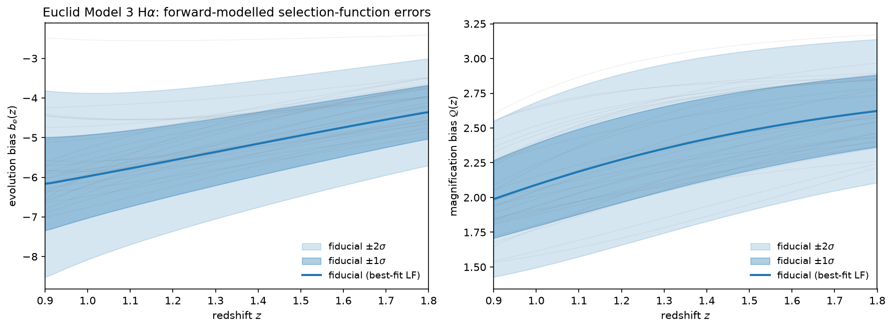

Luminosity Functions
====================

CosmoWAP includes luminosity function classes that compute number densities, magnification bias Q, and evolution bias for a given model. See `arXiv:2107.13401 <https://arxiv.org/abs/2107.13401>`_ for an overview.

**Key definitions** (for flux-limited surveys):

.. math::

   b_e = -\frac{\partial \ln \bar{n}_g}{\partial \ln(1+z)}\bigg|_{F_c}, \quad
   Q = -\frac{\partial \ln \bar{n}_g}{\partial \ln L}\bigg|_{F_c}

Hα Luminosity Functions
-----------------------

For flux-limited Hα surveys (Euclid, Roman). See Pozzetti et al. (2016) [arXiv:1603.01453] for model details:

.. math::

   \Phi(z, y) = \phi^*(z) \, g(y), \quad y \equiv L/L^*

where the shape function g(y) and characteristic density φ∗(z) are model-dependent.

.. py:class:: lib.luminosity_funcs.Model1LuminosityFunction(cosmo)

   Standard Schechter function with g(y) = y^α exp(-y), α = -1.35. Pozzetti et al. (2016) [arXiv:1603.01453] Model 1.

.. py:class:: lib.luminosity_funcs.Model2LuminosityFunction(cosmo)

   Schechter function g(y) = y^α exp(-y), α = -1.40, with a constant φ*(z) (no density evolution) and a quadratic-in-z characteristic luminosity peaking at z_break: log₁₀ L*(z) = -c (z - z_break)² + log₁₀ L*_break. Pozzetti et al. (2016) [arXiv:1603.01453] Model 2.

.. py:class:: lib.luminosity_funcs.Model3LuminosityFunction(cosmo)

   Broken power-law fit to luminosity function data with g(y) = y^α / (1 + (e - 1) * y^ν) (α = -1.587, ν = 2.288). Updated model from [arXiv:1910.09273] with reduced redshift range.

**Methods:**

.. method:: luminosity_function(L, zz)

   Compute Φ(L, z) [h³/Mpc³].

.. method:: number_density(F_c, zz)

   Integrate luminosity function above flux cut F_c [erg/cm²/s].

.. method:: get_Q(F_c, zz)

   Magnification bias: Q = y_c g(y_c) / G(F_c, z).

.. method:: get_nQ(F_c, zz)

   Number density and magnification bias together, sharing a single luminosity
   integral - cheaper than separate ``number_density``/``get_Q`` calls when both
   are needed.

.. method:: get_be(F_c, zz)

   Evolution bias from number density evolution and Q.

.. method:: get_b_1(F_c, zz)

   Flux-averaged linear bias using semi-analytic model from `arXiv:1909.12069 <https://arxiv.org/abs/1909.12069>`_ (Table 2).

Magnitude-Limited Surveys (k-correction)
----------------------------------------

If a survey measures galaxy fluxes in fixed wavelength bands, this leads to a K-correction
for the redshifting effect on the bands. In that case, it is standard to work in terms of
dimensionless magnitudes.

Here these surveys can detect objects above a minimum apparent magnitude (m_c) which is linked to the threshold absolute magnitude:

.. math::

   M_c(z) = m_c - 5 \log_{10}\left[\frac{d_L(z)}{10\,\mathrm{pc}}\right] - K(z)

Works with schechter type luminosity functions where:

.. math::

    Φ(z, y) = φ∗(z) g(y) where y ≡ M - M*(z)

φ∗(z), g(y) are defined in the child classes for a specific luminosity function

See: arXiv:2107.13401 for an overview

.. py:class:: lib.luminosity_funcs.BGSLuminosityFunction(cosmo)

   DESI BGS r-band luminosity function. Schechter with α = -1.23, K(z) = 0.87z.

.. py:class:: lib.luminosity_funcs.LBGLuminosityFunction(cosmo)

   Lyman Break Galaxy UV luminosity function for MegaMapper. Parameters from `arXiv:1904.13378 <https://arxiv.org/abs/1904.13378>`_ (Table 3). K(z) = -2.5 log₁₀(1+z). Bias model from Eq. (2.7).

**Methods:** Same as Hα classes, but with magnitude cut ``m_c`` instead of flux cut.

For magnitude-limited surveys:

.. math::

   Q(z, m_c) = \frac{5}{2 \ln(10)} \frac{\Phi(z, M_c)}{\bar{n}_g(z, m_c)}

Usage
-----

.. code-block:: python

    from cosmo_wap.lib.luminosity_funcs import Model3LuminosityFunction
    from cosmo_wap.lib import utils
    import numpy as np

    cosmo = utils.get_cosmo()
    LF = Model3LuminosityFunction(cosmo)

    z = np.linspace(0.9, 1.8, 50)
    F_c = 2e-16  # erg/cm²/s

    # Number density
    n_g = LF.number_density(F_c, z)

    # Magnification and evolution biases
    Q = LF.get_Q(F_c, z)
    be = LF.get_be(F_c, z)

    # Linear bias - from a magnitude dependent parameterization
    b1 = LF.get_b_1(F_c, z)

Forward-Modelled Evolution- and Magnification-Bias Priors
---------------------------------------------------------

The evolution bias :math:`b_e(z)` and magnification bias :math:`Q(z)` are derived from a
luminosity function whose shape parameters are themselves *fitted* with errors. CosmoWAP
propagates these fit errors onto :math:`b_e`/:math:`Q` with a Monte-Carlo push-forward,
following
HorizonGRound (`Wang, Beutler & Bacon 2020 <https://github.com/MikeSWang/HorizonGRound>`_,
`arXiv:2007.01802 <https://arxiv.org/abs/2007.01802>`_).

Each model stores its fitted parameters as attributes together with their diagonal
:math:`2\sigma` errors (``LF.fit_params`` / ``LF.fit_errors``). The forward model draws the
parameters from a Gaussian centred on the best fit,

.. math::

   \theta^{(i)} \sim \mathcal{N}(\hat{\theta},\, \Sigma_\theta), \qquad
   \Sigma_\theta = \mathrm{diag}\!\left[(\sigma^{2\sigma}_\theta / 2)^2\right],

and recomputes :math:`b_e(z)` and :math:`Q(z)` for each draw via the existing
``get_be`` / ``get_Q``. The spread of the resulting curves gives the joint
:math:`(b_e, Q)` covariance at each redshift (a full parameter covariance can be supplied
instead of the diagonal errors).

.. py:class:: lib.lf_priors.LFBiasPrior(LF, evaluate, components, z_grid, *, errors=None, cov=None, sigma_level=2, n_samples=1000, seed=None)

   Monte-Carlo push-forward of luminosity-function fit-parameter errors onto a prior on
   :math:`b_e(z)` and :math:`Q(z)`. Use :meth:`from_survey` to build it from a survey;
   key methods are ``mean(z)``, ``std(z)`` and ``covariance(z)``.

.. code-block:: python

    from cosmo_wap.lib.lf_priors import LFBiasPrior

    sp = cw.SurveyParams.Euclid(cosmo)            # Model 3 Hα luminosity function
    prior = LFBiasPrior.from_survey(sp, n_samples=2000)

    be_mean, Q_mean = prior.mean(z)               # forward-modelled means
    be_std, Q_std = prior.std(z)                  # 1σ errors on b_e, Q
    cov = prior.covariance(z)                     # (len(z), 2, 2) joint (b_e, Q) covariance

All three Hα models carry fit errors. Over the Euclid range :math:`0.9 < z < 1.8` the propagated
:math:`1\sigma` errors are :math:`\sigma(b_e)\sim 0.7\text{--}1.2`,
:math:`\sigma(Q)\sim 0.26\text{--}0.31` for Model 3 (dominated by the broad ``beta`` and
``nu`` uncertainties), :math:`\sigma(b_e)\sim 0.4\text{--}0.9`,
:math:`\sigma(Q)\sim 0.2\text{--}0.4` for Model 1 (whose :math:`b_e` error peaks near the
:math:`z_b` break in :math:`\phi^*(z)`) and :math:`\sigma(b_e)\sim 0.8`,
:math:`\sigma(Q)\sim 0.2` for Model 2. The constant ``log_phi_star`` cancels in the bias, so
in Model 2 (with no density evolution) the prior is driven by ``alpha``, ``log_L_star_break``
and the quadratic ``c``. The Model 3 case is shown below:

The same object feeds the forecast as a prior on the per-bin :math:`b_e`/:math:`Q`. In the
Fisher matrix the inverse :math:`(b_e, Q)` covariance is added onto the per-bin block, and
in the MCMC sampler it is added as a Gaussian penalty on the per-bin :math:`b_e`/:math:`Q`
amplitudes:

.. code-block:: python

    # Fisher: inject the prior into the per-bin b_e/Q block
    fish = forecast.get_fish("fNL", per_bin_params=["be", "Q"], lf_prior=True)

    # MCMC sampler: add it as a Gaussian prior likelihood (mirrors planck_prior)
    sampler = forecast.sampler(["fNL"], terms=["NPP"], pkln=[0, 2],
                               per_bin_params=["be", "Q"], lf_prior=True)

Passing ``lf_prior=True`` builds the prior from the survey's luminosity function; a
pre-built ``LFBiasPrior`` can be passed instead for custom errors or to reuse one MC
across calls. A bright/faint split is handled (on both the Fisher and sampler paths) via
the per-tracer components ``["Xbe", "Ybe", "XQ", "YQ"]``, keeping the bright–faint
correlation induced by the shared luminosity function:

.. code-block:: python

    sampler = forecast.sampler(["fNL"], terms=["NPP", "GR2"], pkln=[0, 2], all_tracer=True,
                               per_bin_params=["Xbe", "XQ", "Ybe", "YQ"], lf_prior=True)

To avoid rebuilding the Monte-Carlo push-forward on every call, build it once and pass the
object in:

.. code-block:: python

    from cosmo_wap.lib.lf_priors import LFBiasPrior

    bias_prior = LFBiasPrior.from_survey(cf.survey_params[0], n_samples=1000, seed=0)
    fish = forecast.get_fish("fNL", per_bin_params=["be", "Q"], lf_prior=bias_prior)
